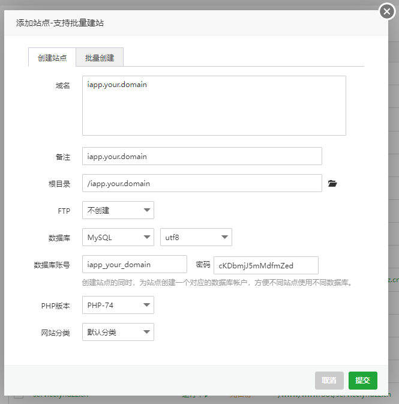

# 宝塔安装

<mark style="color:blue;">如果您用的是宝塔面板：请您填写好这些选项，注意数据库和PHP版本</mark>\
\
<mark style="color:blue;">创建好了之后访问您的域名，如果出现这个提示</mark>\ <mark style="color:blue;"></mark> (1).png>)\
则证明您的环境基本正常，这里您可以选择是否添加SSL来保证您的安全\
.png>)\


我们需要进行两步很重要的操作，如果不成功，您的站点将无法访问\
.png>)\
在这一步请不要忘记保存\
.png>)

Nginx的伪静态：

```nginx
location / { 
        if (!-e $request_filename){
                rewrite ^(.*)$ /index.php?s=$1 last;
                break; 
             }
}
```

\
Apache的伪静态：

```apacheconf
<IfModule mod_rewrite.c>
  Options +FollowSymlinks -Multiviews
  RewriteEngine On
 
  RewriteCond %{REQUEST_FILENAME} !-d
  RewriteCond %{REQUEST_FILENAME} !-f
  RewriteRule ^(.*)$ index.php/$1 [QSA,PT,L]
</IfModule>
```

伪静态概念：

比如百度网站上放了一个abc.html文件，你想访问它就直接输入`baidu.com/abc.html`。\
Web服务器看到这样的地址就直接找到这个文件输出给客户端。

动态网页就是，假如你想做一个显示当前时间的页面\
那么就可以写个PHP文件，然后访问`baidu.com/abc.php`。\
Web服务器看到这样的地址，找到`abc.php`这个文件，会交给PHP执行后返回给客户端。\
而动态网页往往要输入参数，所以地址就变成`baidu.com/abc.php?a=1&b=2`。

搜索引擎比较烦这种带问号的动态网页，因为参数可以随便加，而返回内容却不变所以会对这种网页降权。

于是有了`mod_rewrite`，它可以重新映射地址。\
比如当前这个页面的地址`http://baidu.com/abc.html`，Web服务器收到请求后会重新映射\
为`http://baidu.com/page.php?id=abc`，然后再执行那个PHP程序。\
这样，在内部不改变的情况下，对外呈现出来的网址变成了没有问号的象静态网页的网址一样。\
于是有人给起了个名字叫“伪静态”。其实也没什么伪的，就是没有问号的静态网址\
让搜索引擎舒服点而已。（这个已经很明确了吧）\
\
做好这些准备后你就可以上传源码了（你也可以上传完毕在搞这些）\
上传-》解压-》你可以看到解压的目录有一个：mrhtsqlcs.sql  ，这个就是默然Iapp需要用到的数据库文件\
我们有两种方式来安装数据库文件\
1、通过宝塔的导入功能来自动导入文件\
.png>)\
.png>)\
.png>)\
2、在著名的PHPMyAdmin里面导入\
.png>)\
.png>)\
\
.png>)

如图示，我不想多写什么，因为太简单\
接下来我们需要修改一下可可爱爱的Config文件，文件在\
your.domain/config/database.php\
.png>)\
当我们费劲的到了这里（划掉）\
.png>)\
我TM直接差评（划掉

总之大家不用担心，这是正常页面，访问your.domain/admin\
账号：admin\
密码：123456

.png>)\
我们就进入了后台，至此就安装成功。
